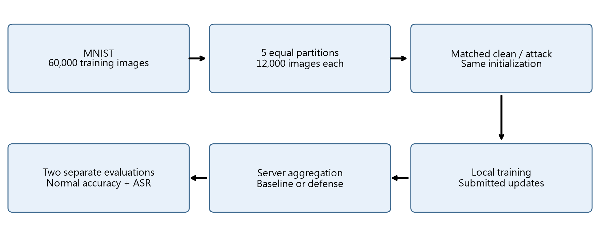
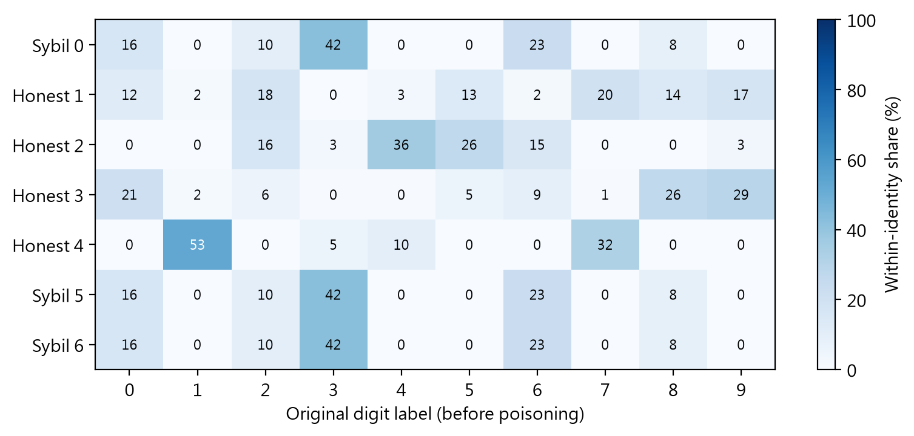
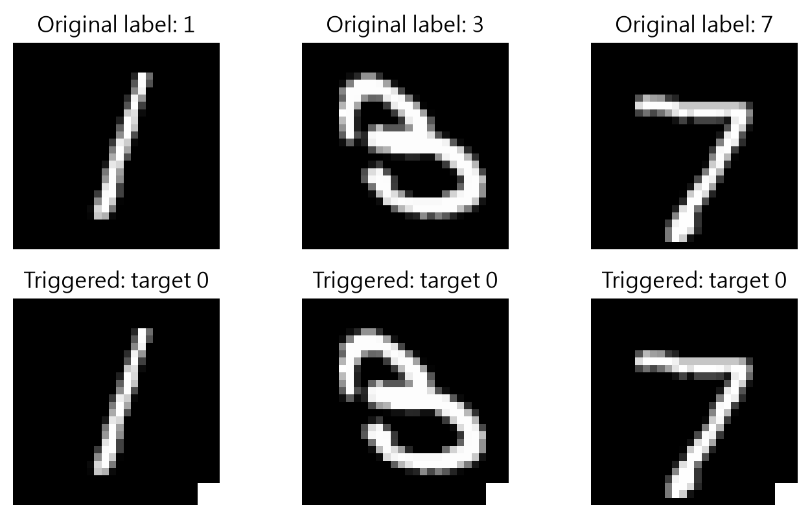
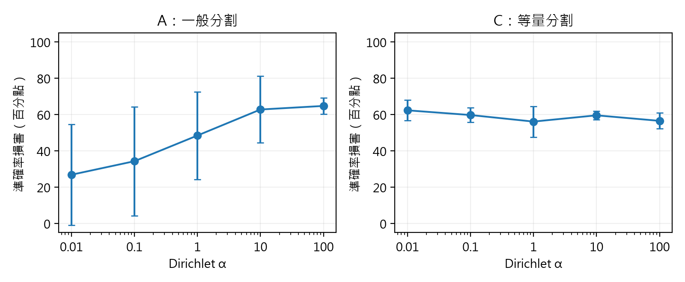
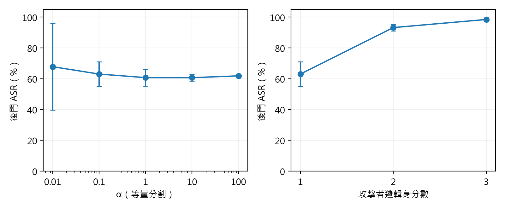
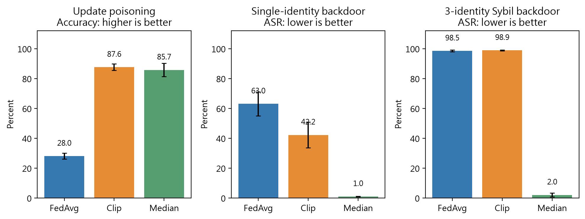
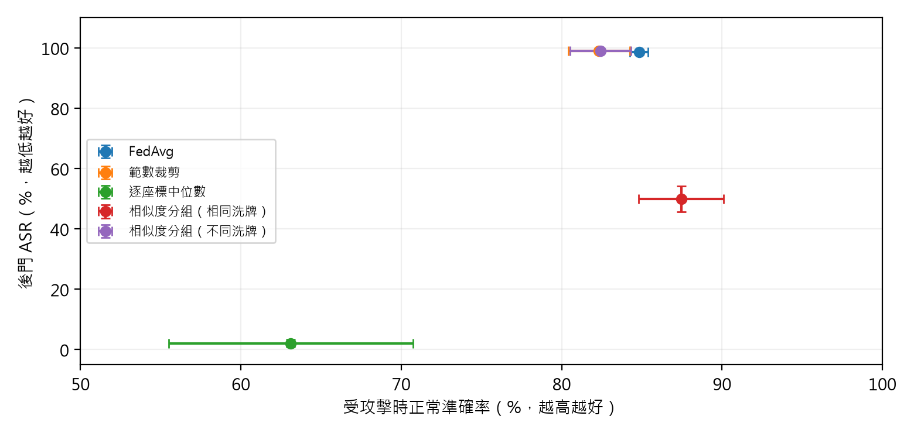
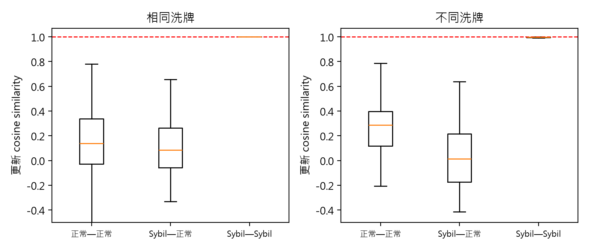
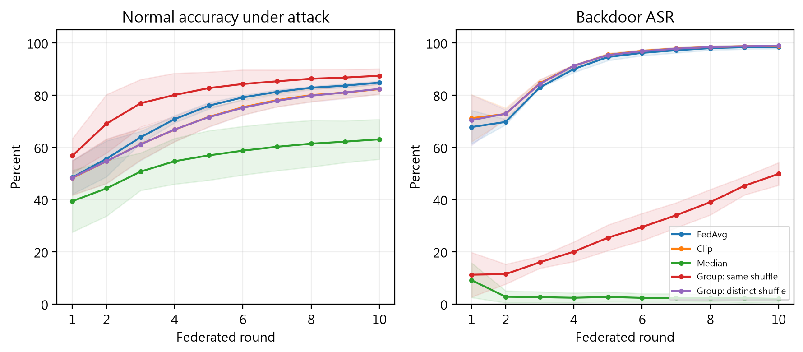
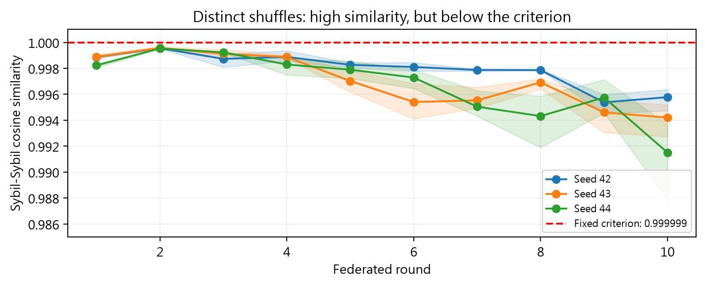

# 中文摘要

本研究探討聯邦學習中，資料分布、更新大小與重複身分如何影響攻擊及防禦。以MNIST建立配對實驗，使用三個隨機種子、十輪訓練，比較模型更新投毒、後門與Sybil後門，再測試範數裁剪、逐座標中位數及相似度分組。結果顯示，裁剪可將更新放大攻擊下的準確率由28.03%恢復至87.59%；但對三身分Sybil後門，成功率仍達98.85%。相似度分組將相同複製身分合併，使後門成功率降至49.88%，正常準確率為87.46%。然而，只改變複製身分的洗牌種子，分組即未合併任何身分，後門成功率升至98.94%。研究指出，限制更新大小與重複權重可處理不同風險，但近乎相同更新的分組規則有明確限制，評估防禦須同時檢查正常辨識、後門成功率與非相同複製身分。

# Abstract

This study examines how data distribution, update magnitude, and duplicated identities affect attacks and defenses in federated learning. Using MNIST, we conducted matched clean and attacked experiments with three random seeds and ten training rounds. We compared model-update poisoning, trigger-based backdoors, and Sybil backdoors, followed by norm clipping, coordinate-wise median aggregation, and similarity grouping. Clipping restored accuracy under update amplification from 28.03% to 87.59%, but the attack success rate for a three-identity Sybil backdoor remained 98.85%. Grouping identical replicas reduced backdoor success to 49.88% while retaining 87.46% normal accuracy. However, changing only the deterministic shuffle seeds of the appended replicas prevented all grouping and increased backdoor success to 98.94%. These results show that limiting update magnitude and duplicated voting weight addresses different risks. They also reveal a clear limitation of near-duplicate grouping: modest changes in local training order can defeat its fixed criterion. Defense evaluation should jointly measure normal accuracy, backdoor success, and behavior under nonidentical replicas. The findings apply to this controlled, small-scale setup and do not establish universal robustness.

# 壹、前言

## 一、研究動機

聯邦學習讓不同裝置保留自己的訓練資料，再把模型更新交給伺服器整合。這種方式減少集中原始資料的需要，但也帶來一個問題：伺服器收到的更新是否值得信任？如果某個參與者刻意放大更新，或在本地圖片加上特殊記號，整體模型是否仍能正常學習？

我們最初觀察模型更新投毒時，發現同樣把更新放大十倍，不同隨機種子的損害差距很大。因此，本研究沒有直接把差異歸因於資料不均，而是逐步檢查資料筆數、聚合權重與可重現性。接著加入後門與重複身分攻擊，最後測試防禦是否只對「完全相同的複製者」有效。

## 二、研究目的與問題

（一）區分資料標籤分布、客戶端資料量與聚合權重對模型更新投毒的影響。

（二）檢驗後門能否在正常準確率接近原有表現時，仍達到高攻擊成功率。

（三）固定攻擊者的唯一訓練資料，觀察增加邏輯身分是否放大後門。

（四）比較範數裁剪、逐座標中位數及相似度分組的攻擊抑制效果與正常辨識代價。

（五）固定相似度門檻，只改變複製身分的洗牌種子，檢驗分組防禦的適用界線。

## 三、文獻回顧與本研究定位

McMahan等人（2017）提出以本地訓練與模型平均進行聯邦學習，並討論資料分布不一致與資料量不均的情況。本研究採用樣本數加權的FedAvg作為主要基準，但不把「資料不離開裝置」等同於完整的隱私或安全保證。

Bagdasaryan等人（2020）研究透過模型替換植入聯邦後門，顯示正常任務表現與後門行為可能並存。本研究的後門採固定圖樣與改標籤的資料投毒，沒有重現該論文完整的模型替換攻擊，因此兩者的結果不能直接比較。

Yin等人（2018）分析以逐座標中位數等方式處理不可信更新的分散式學習方法。本研究只將逐座標中位數作為實驗基準，不將其理論條件直接套用到本研究的Non-IID神經網路。

Fung等人（2020）的FoolsGold利用客戶端更新的多樣性處理Sybil投毒，說明相似度與重複身分的關係已有研究基礎。本研究沒有實作或比較FoolsGold；所測試的是固定門檻、單輪連通分量與每群一票的簡化方法，並以不同洗牌的負面結果界定其限制。

本研究的重點是可追溯的配對比較與逐步控制變因，而非宣稱提出通用的Sybil辨識演算法。相似度門檻是在初步診斷之後、分組防禦訓練之前固定；不同洗牌測試沿用原門檻，未依結果重新調整。

# 貳、研究方法或過程

## 一、研究設備、資料與訓練設定

實驗以Python在單機CPU上依序模擬各客戶端與伺服器，並非實際部署的跨網路系統。保存的環境紀錄顯示Python 3.13.12、PyTorch 2.14.0、torchvision 0.29.0、NumPy 2.5.3及Flower 1.36.0；設定單一CPU執行緒並開啟確定性運算。既有紀錄未完整保存實體主機型號，因此不推測硬體規格，也不以運算速度作結論。

表一　共同實驗設定（資料來源：本研究設定檔）

| 項目 | 設定 |
| --- | --- |
| 資料集 | MNIST（LeCun等人，1998）；訓練60,000張、正常測試10,000張；28×28灰階 |
| 模型 | 展平784維 → 全連接128維 → ReLU → 全連接10類 |
| 訓練 | 10輪；每輪全部身分參與；本地1 epoch；batch size 32 |
| 最佳化 | SGD；學習率0.01；損失為交叉熵 |
| 隨機種子 | 42、43、44；每一設定均有配對的無攻擊／攻擊條件 |
| 等量分割 | 5份；每份12,000張；容量受限Dirichlet分割 |
| 攻擊者 | 原始client 0；誠實資料固定為client 1–4 |
| 防禦代表設定 | α＝0.1；模型更新放大10倍／後門比例0.2／Sybil數3 |

## 二、資料分割與配對控制

一般Dirichlet分割以α控制各客戶端的標籤分配；α較小通常產生較偏斜的標籤分布，但實際分布仍受種子影響。早期實驗未限制每個客戶端的總筆數，因此改變α時，資料量與樣本加權FedAvg的權重也可能一起改變。

後續改用容量受限分割，每個原始客戶端恰有12,000張，五份合計包含完整訓練集且不重複。這可以固定各原始客戶端20%的聚合權重，但也改變了分割程序；一般分割與等量分割之間不能視為只改變一個因素。

在同一種子、同一設定內，無攻擊與攻擊條件使用相同初始參數、分割索引與洗牌種子。後門選樣固定使用種子加2000，原始客戶端洗牌使用種子加1000再加客戶端編號。程式保存設定、資料與分割雜湊、初始參數雜湊、原始碼快照及套件版本，避免把實驗差異混入攻擊效果。

## 三、攻擊定義

（一）模型更新投毒：先正常完成本地訓練，再把client 0的更新乘上倍率s。若本輪全域參數為w，本地參數為wᵢ，送出參數為w＋s(wᵢ−w)。它改變模型更新，沒有更改圖片或標籤，故不稱為資料投毒。s＝1是沒有放大的控制條件。

（二）後門資料投毒：在攻擊者固定20%的本地樣本，也就是2,400張圖片上加入白色3×3圖樣，位置為零起算列、欄25至27，像素值為1.0，標籤改為0。選樣可能包含原本就是0的圖片；這些圖片仍會加圖樣。誠實客戶端與正常測試資料維持不變。

（三）Sybil後門：Sybil數代表邏輯攻擊身分數。三身分時，伺服器收到七個提交，資料來源依序為[0,1,2,3,4,0,0]。三個攻擊身分共用原始client 0的12,000張，不增加唯一資料，每個身分均回報12,000筆。原始FedAvg下，攻擊群權重為s／(4＋s)，s＝1、2、3時分別為20%、33.33%、42.86%。無攻擊對照也保留相同身分複製，只關閉後門。

## 四、聚合方法與相似度診斷

FedAvg依回報樣本數加權平均提交參數。範數裁剪先計算Δᵢ＝wᵢ−w的完整模型L2範數，再取當輪所有提交範數的中位數τ。令fᵢ＝min(1, τ／‖Δᵢ‖₂)，零更新令fᵢ＝1；裁剪後更新為fᵢΔᵢ，再使用原有FedAvg。此規則不使用攻擊標籤。

逐座標中位數分別取每一個更新座標的中位數，加回當輪全域參數。每個邏輯身分在各座標各有一票，不依資料筆數加權。它與範數裁剪的限制方式不同，不保證能在所有異質資料中保留相同的正常表現。

更新相似度定義為cos(i,j)＝(Δᵢ·Δⱼ)／(‖Δᵢ‖₂‖Δⱼ‖₂)。計算使用伺服器實際收到的參數，扣除同一輪全域參數；在聚合之前以float64運算。零範數的相似度記為未定義，不當作0或1。每輪保存七個範數與21個不重複身分配對，標籤僅用於事後統計。

相似度分組先沿用上述裁剪，再把原始非零更新方向的cosine≥0.999999配對連成無向圖。每個連通分量形成一群，群內先取平均，再讓每群以相同權重參與聚合。零更新不建立邊。門檻代表距離完全相同方向的固定容許誤差，沒有依最終ASR或準確率選擇。

若共有K群，群G有|G|個成員，理想算式為w_next＝w＋(1／K)Σ_G[(1／|G|)Σᵢ∈G fᵢΔᵢ]。實作沿用原生型別重建裁剪參數，再以float64計算群平均，最後轉回模型型別。群內有多少複製身分都只占一個有效參與者。連通分量可能透過鏈結合併，因此群內並非每一對都必須直接超過門檻。

## 五、不同洗牌的穩健性測試

最後只改變兩個新增Sybil身分的洗牌種子。邏輯身分0、5、6分別使用seed＋1000、seed＋1005、seed＋1006；原始誠實身分1–4保持原種子。每次執行只在起始時設定，之後按輪數正常推進亂數狀態。相同的指定方式同時套用於無攻擊與後門條件。

表二　預先固定的Sybil洗牌種子

| 實驗seed | 身分0 | 身分5 | 身分6 |
| --- | --- | --- | --- |
| 42 | 1042 | 1047 | 1048 |
| 43 | 1043 | 1048 | 1049 |
| 44 | 1044 | 1049 | 1050 |

這個測試固定α＝0.1、三個Sybil身分、後門比例0.2及原先的0.999999門檻，不改初始化、資料、選樣、觸發圖樣或最佳化器。不同洗牌只移除更新必然相同的條件，不保證每個更新都一定不同。此階段有3種子×2配對條件，共6次新執行、60個執行輪次。

## 六、評估指標、統計與驗證

正常準確率與交叉熵損失由未修改的10,000張測試圖計算。後門攻擊成功率ASR則只用原標籤不為0的9,020張測試圖，加上同一圖樣後，計算被預測為0的比例。ASR測試集不取代正常測試集；無攻擊模型也接受同一ASR評估，作為自然誤判的基準。

模型投毒的準確率損害＝無攻擊準確率−攻擊準確率；配對ASR增加＝攻擊ASR−同設定無攻擊ASR，單位均為百分點。防禦正常準確率代價＝FedAvg無攻擊準確率−防禦無攻擊準確率，負值表示後者較高。不同洗牌階段仍以原本相同洗牌FedAvg為參考，因此這項代價同時包含洗牌變更，不是純粹的防禦成本。

表中的平均與樣本標準差以三個種子的第10輪結果計算，標準差分母為n−1；先在每個種子內求配對差，再跨種子摘要。三十或六十個執行輪次不是額外的獨立種子，重用與重跑也不增加獨立樣本數。本研究沒有進行正式顯著性檢定，故不使用統計顯著的結論。

有效攻擊群權重按每群的攻擊身分比例除以群數後加總，表示分組後、個別裁剪因子之前的線性配額，不等同於對預測的因果影響。誤分組紀錄包含進入非單一成員群的誠實身分數、同群誠實配對數及誠實／Sybil混合群數。

程式的快速測試檢查觸發位置、改標籤、固定選樣、Sybil資料重複、範數界限、cosine零向量與對稱性、連通分量、一群一票、不同洗牌及配對一致性。報告整理時只讀取已存結果，核對完成雜湊及來源紀錄，並從逐次資料重算防禦摘要，沒有重新訓練或覆寫原始結果。

# 參、研究結果與討論

本節各表均整理自本研究保存的逐次結果與統計摘要；圖表中的±表示三個種子的樣本標準差。

## 一、模型更新投毒：資料量與權重的控制

表三　A與C的α比較；損害單位為百分點，±為樣本標準差

| α | A正常準確率% | A受攻擊準確率% | A損害 | C損害 |
| --- | --- | --- | --- | --- |
| 0.01 | 69.96 | 43.20 | 26.76 ± 27.87 | 62.26 ± 5.70 |
| 0.1 | 82.87 | 48.65 | 34.22 ± 30.08 | 59.67 ± 3.99 |
| 1 | 90.58 | 42.20 | 48.38 ± 24.11 | 56.05 ± 8.46 |
| 10 | 90.92 | 28.21 | 62.71 ± 18.33 | 59.51 ± 2.33 |
| 100 | 90.93 | 26.25 | 64.68 ± 4.45 | 56.46 ± 4.37 |

A使用一般Dirichlet分割、倍率10。平均損害隨α由0.01提高到100而從26.76升到64.68個百分點。然而，客戶端筆數與權重也一起改變，故不能只解釋成Non-IID程度造成。C固定每人12,000張後，各α損害仍介於56.05至62.26個百分點，沒有A的遞增形狀。A與C的分割演算法不同，這個對照不能證明權重是唯一原因。

表四　B：α＝0.1的更新放大倍率比較

| 倍率 | 正常準確率% | 受攻擊準確率% | 損害（百分點） |
| --- | --- | --- | --- |
| 1 | 82.87 | 82.87 | 0.00 ± 0.00 |
| 2 | 82.87 | 81.58 | 1.28 ± 1.50 |
| 5 | 82.87 | 77.87 | 5.00 ± 4.45 |
| 10 | 82.87 | 48.65 | 34.22 ± 30.08 |
| 20 | 82.87 | 42.82 | 40.05 ± 37.95 |

倍率1的平均準確率損害為0；倍率10與20的平均損害為34.22與40.05個百分點。不過，平均值增加不代表每個種子都單調變差，例如seed 44在倍率20的損害小於倍率10。這顯示更新大小重要，但仍與特定資料配置共同作用。

表五　D：同一分割改變聚合權重

| seed | 原始加權損害 | 等權損害 | 等權−加權 |
| --- | --- | --- | --- |
| 42 | 56.32 | 31.02 | -25.30 |
| 43 | -0.04 | 26.31 | 26.35 |
| 44 | 46.38 | 44.43 | -1.95 |

D保留A的相同分割、初始化與洗牌，只比較樣本加權和每人20%的等權平均，是較直接的權重控制。seed 43的攻擊者僅有1,135張，占1.89%；改為等權後，損害由−0.04變成26.31個百分點。其他種子並非同方向變化，因此等權平均只是控制實驗，不是已證明的防禦。

針對seed 43的近零損害另做重現查核，seed 42與43的十輪準確率、損失及更新紀錄均與原始執行一致；seed 43仍為85.33%無攻擊、85.37%受攻擊。它不是一次訓練失敗或漏做攻擊，但也不能據此說模型具有免疫力。

## 二、後門：正常準確率無法單獨代表安全

表六　等量客戶端的後門α實驗

| α | 正常→受攻擊準確率% | 後門ASR% | 配對ASR增加 |
| --- | --- | --- | --- |
| 0.01 | 85.56 → 85.31 | 67.82 ± 28.08 | 66.87 ± 27.82 |
| 0.1 | 87.70 → 87.61 | 63.04 ± 8.04 | 62.24 ± 8.07 |
| 1 | 90.73 → 90.68 | 60.72 ± 5.48 | 59.88 ± 5.47 |
| 10 | 90.89 → 90.86 | 60.69 ± 2.09 | 59.87 ± 2.13 |
| 100 | 90.99 → 90.94 | 61.86 ± 0.56 | 61.08 ± 0.60 |

α＝0.1時，正常準確率由87.70%變成87.61%，但ASR由0.80%變成63.04%。因此正常辨識幾乎沒受損，並不表示觸發後的錯誤行為不存在。α掃描的平均ASR沒有清楚的單調關係；較小α的種子差異較大，例如α＝0.01的ASR標準差為28.08，而α＝100為0.56。

## 三、Sybil：唯一資料固定，重複權重仍能放大攻擊

表七　原始Sybil後門結果

| Sybil數 | 攻擊群權重% | 無攻擊準確率% | 受攻擊準確率% | 後門ASR% |
| --- | --- | --- | --- | --- |
| 1 | 20.00 | 87.70 | 87.61 | 63.04 ± 8.04 |
| 2 | 33.33 | 86.61 | 86.77 | 93.23 ± 2.13 |
| 3 | 42.86 | 84.11 | 84.82 | 98.50 ± 0.64 |

攻擊者仍只有原始12,000張唯一資料，但身分由1個增至3個，ASR由63.04%提高到98.50%。同時，無攻擊Sybil對照的正常準確率由87.70%降到84.11%，表示複製身分也改變正常資料來源的相對影響。身分數與群體權重一起增加，本實驗沒有把兩者分別隔離。

## 四、既有防禦：攻擊抑制與正常表現的取捨

表八　代表攻擊下的防禦結果；準確率與ASR為%，正常代價為百分點

| 攻擊 | 方法 | 受攻擊準確率 | ASR | 正常代價 |
| --- | --- | --- | --- | --- |
| 模型更新投毒 | FedAvg | 28.03 | 不適用 | 0.00 |
| 模型更新投毒 | 範數裁剪 | 87.59 | 不適用 | 0.15 |
| 模型更新投毒 | 逐座標中位數 | 85.75 | 不適用 | 3.23 |
| 單身分後門 | FedAvg | 87.61 | 63.04 | 0.00 |
| 單身分後門 | 範數裁剪 | 87.35 | 42.20 | 0.15 |
| 單身分後門 | 逐座標中位數 | 84.69 | 0.98 | 3.23 |
| 三身分後門 | FedAvg | 84.82 | 98.50 | 0.00 |
| 三身分後門 | 範數裁剪 | 82.34 | 98.85 | 3.36 |
| 三身分後門 | 逐座標中位數 | 63.12 | 2.03 | 20.87 |

在等量模型更新投毒下，FedAvg準確率為28.03%，裁剪後為87.59%；受攻擊loss也由5.293降至0.427。裁剪無攻擊時只付出0.15個百分點的準確率代價，顯示它適合本研究的放大更新攻擊。

對單身分後門，裁剪將ASR由63.04%降至42.20%，仍有明顯殘留。逐座標中位數的ASR為0.98%，受攻擊正常準確率84.69%，無攻擊代價3.23個百分點。此處中位數的抑制效果較強，但不能忽略正常表現的改變。

對三身分Sybil後門，裁剪ASR仍為98.85%。逐座標中位數雖將ASR壓至2.03%，受攻擊正常準確率卻只有63.12%；其無攻擊準確率也只有63.24%，代價達20.87個百分點。因此低ASR不能單獨當成成功防禦的充分證據。

## 五、相同複製身分的分組結果

原始FedAvg診斷共有180個Sybil—Sybil配對，其cosine介於0.9999999999999998與1.0；360個正常—正常配對最高為0.7873435075。這是同一實驗中的重複輪次觀察，不是180個獨立實驗，也不是對所有Non-IID客戶端的辨識保證。

相同洗牌的分組防禦在所有60個執行輪次中，都把0、5、6合成一群，其他四人維持獨立，沒有觀察到誠實身分誤合併。有效群數為5，攻擊群配額由42.86%降為20%。受攻擊準確率為87.46%，ASR為49.88%；雖減少身分放大效果，後門仍有約一半成功，不能稱為完全阻擋。

## 六、不同洗牌：固定門檻的失效界線

表九　三身分Sybil防禦與不同洗牌測試（平均±樣本標準差）

| 方法／洗牌 | 受攻擊準確率% | ASR% | 配對ASR增加 |
| --- | --- | --- | --- |
| FedAvg | 84.82 ± 0.57 | 98.50 ± 0.64 | 97.58 ± 1.18 |
| 範數裁剪 | 82.34 ± 1.90 | 98.85 ± 0.32 | 97.84 ± 1.16 |
| 逐座標中位數 | 63.12 ± 7.62 | 2.03 ± 1.29 | 0.08 ± 0.89 |
| 相似度分組（相同洗牌） | 87.46 ± 2.65 | 49.88 ± 4.34 | 49.10 ± 4.54 |
| 相似度分組（不同洗牌） | 82.42 ± 1.90 | 98.94 ± 0.30 | 97.92 ± 1.12 |

只更改身分5與6的洗牌種子後，固定0.999999門檻在所有60個執行輪次都沒有連成任何群，七個身分各自一群，攻擊群配額回到42.86%。沒有誤合併正常身分，但這也表示三個Sybil未被合併。ASR升至98.94%±0.30，受攻擊正常準確率為82.42%±1.90。

與相同洗牌的同一防禦相比，平均ASR增加49.06個百分點，受攻擊準確率下降5.05個百分點。這是對固定規則的反例，而不是重新調低門檻後的結果；本研究保留原門檻，避免看到答案後改規則。

表十　不同洗牌測試的各種子最終結果

| seed | 無攻擊準確率% | 受攻擊準確率% | 後門ASR% | 配對ASR增加 |
| --- | --- | --- | --- | --- |
| 42 | 79.71 | 80.34 | 98.67 | 97.00 |
| 43 | 82.52 | 82.85 | 98.89 | 97.58 |
| 44 | 80.43 | 84.06 | 99.26 | 99.17 |

不同洗牌的全部條件中，Sybil—Sybil cosine範圍為0.987900至0.999665。雖然它們仍相當接近，卻未達近乎完全相同的0.999999門檻。不能由此推論所有相似度方法都失效；本研究只證明這個固定單輪近重複規則，對這種洗牌變化不具穩健性。

## 七、整體解釋與限制

三類攻擊利用的因素不同：模型更新投毒直接增加更新幅度；後門把特定觸發規則混入正常學習；Sybil則增加同一資料來源的聚合份量。因此，限制單一更新大小不一定限制整個攻擊群，而減少重複票數也不會自動移除後門。

不同洗牌仍使用同一資料，更新方向卻不再完全一致，說明本地隨機訓練順序足以影響單輪相似度。這項發現支持加入非相同複製者作穩健性檢查，而非只用最容易辨認的相同更新驗證防禦。

本研究只測試MNIST、小型全連接模型、十輪訓練、三個種子及一種觸發圖樣；尚未檢驗較大型影像、較長訓練、多種目標、自適應攻擊或實際通訊。伺服器能看到各身分更新，沒有採用會遮蔽個別更新的安全聚合，因此不能直接宣稱相同方法適用所有隱私保護部署。

穩健性測試未另訓練不同洗牌的FedAvg、裁剪與中位數，因此它與這三個基準的比較同時包含洗牌與聚合差異。最直接的控制是與相同洗牌的相似度分組相比。樣本少且未做正式假設檢定，所有差異只作本設定下的描述。

# 肆、結論與應用

## 一、研究結論

（一）模型更新投毒的損害不能只用Non-IID程度解釋。客戶端樣本數與聚合權重是重要控制項；同分割的權重比較比跨分割演算法比較更能釐清問題。

（二）正常準確率與後門安全是不同指標。正常辨識接近原有水準時，觸發後的攻擊成功率仍可很高；測試須保留正常與觸發兩套資料。

（三）攻擊者不需要增加唯一訓練資料，也能藉重複邏輯身分放大影響；正常對照也必須保留相同的身分複製。

（四）範數裁剪適合本研究的更新放大攻擊；中位數能降低後門ASR，但在Sybil設定下可能嚴重犧牲正常辨識。沒有一個已測方法同時在全部設定下表現最好。

（五）相似度分組能減少相同複製者的重複權重，但只改本地洗牌即使ASR回到98.94%。本研究的主要成果包括這項明確的失效界線，而非通用Sybil防禦的宣稱。

## 二、應用價值與後續工作

本研究流程可作為小型聯邦學習安全教材與防禦評估範例：先固定資料與初始化，再分開測量正常辨識、後門行為與群體權重；保存失敗結果與每輪紀錄，使後續方法能在同一基礎上比較。

後續可增加獨立種子與資料集、補上不同洗牌的各聚合方法對照，並在與評估資料分離的開發設定中研究跨輪相似度。若再設計新門檻，應先固定選擇規則並用未參與選擇的條件測試，不能在本次最終ASR上反覆調整後宣稱穩健。以上為未來工作，尚未完成。

# 伍、參考文獻

Bagdasaryan, E., Veit, A., Hua, Y., Estrin, D., & Shmatikov, V. (2020). How to backdoor federated learning. Proceedings of Machine Learning Research, 108, 2938–2948.

Fung, C., Yoon, C. J. M., & Beschastnikh, I. (2020). The limitations of federated learning in Sybil settings. Proceedings of the 23rd International Symposium on Research in Attacks, Intrusions and Defenses, 301–316. USENIX Association.

LeCun, Y., Bottou, L., Bengio, Y., & Haffner, P. (1998). Gradient-based learning applied to document recognition. Proceedings of the IEEE, 86(11), 2278–2324.

McMahan, B., Moore, E., Ramage, D., Hampson, S., & Agüera y Arcas, B. (2017). Communication-efficient learning of deep networks from decentralized data. Proceedings of Machine Learning Research, 54, 1273–1282.

Yin, D., Chen, Y., Ramchandran, K., & Bartlett, P. (2018). Byzantine-robust distributed learning: Towards optimal statistical rates. Proceedings of Machine Learning Research, 80, 5650–5659.
