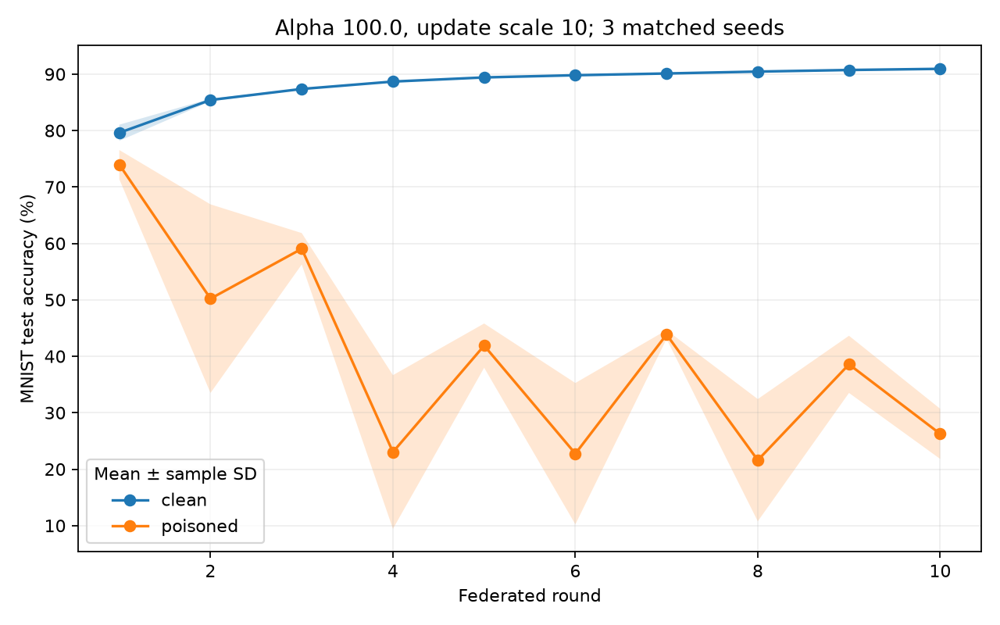
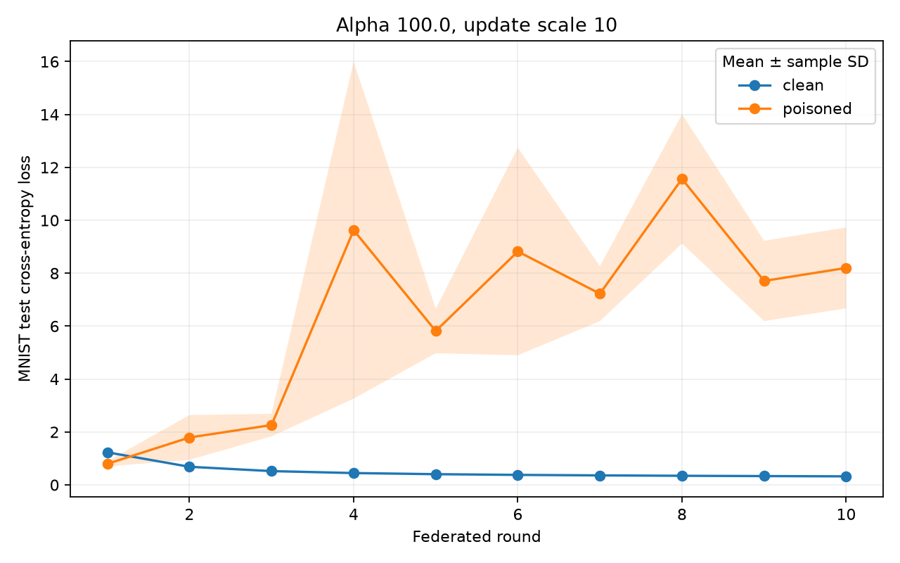

# Matched poisoning experiment

Five clients, 10 rounds, one local epoch, SGD learning rate 0.01, batch size 32, MNIST, alpha 100.0, client 0 update scale 10. Seeds: 42, 43, 44.

| Seed | Clean final accuracy | Poisoned final accuracy | Drop (percentage points) |
| --- | --- | --- | --- |
| 42 | 90.94% | 31.32% | 59.62 |
| 43 | 90.86% | 24.43% | 66.43 |
| 44 | 91.00% | 23.01% | 67.99 |

- Clean mean ± sample SD: **90.93% ± 0.07 percentage points**.
- Poisoned mean ± sample SD: **26.25% ± 4.44 percentage points**.
- Paired accuracy drop: **64.68 ± 4.45 percentage points**.

Accuracy damage = clean accuracy minus poisoned accuracy (percentage points).
Loss damage = poisoned loss minus clean loss. Positive damage means worse performance.

- Clean final loss: **0.3224 ± 0.0017**.
- Poisoned final loss: **8.1999 ± 1.5300**.
- Paired loss damage: **7.8775 ± 1.5285**.




## Checks and limits

All 6 runs completed. Paired runs have identical initial weight and partition hashes and client shuffle seeds. Each partition contains all 60,000 training samples exactly once. All 300 client updates were checked for the expected scale; the malicious client's first update is nonzero in each attacked run. Raw output checksums were verified.

Client 0 has [12750, 11202, 12325] samples across seeds, respectively (FedAvg weights clients by sample count). This changes the attacker's aggregation weight and may help explain the varying impact, but these runs do not isolate that effect.

These are three paired repeats at one alpha and one attack scale, not evidence of a general heterogeneity trend or statistical significance. The attack amplifies an otherwise normal update; it does not inject labels, triggers, or Sybil identities. Positive drops mean lower accuracy under attack; negative drops mean higher accuracy.

Execution uses sequential CPU clients and Flower's sample-weighted aggregation in fixed client order. It evaluates the shared global test set once per round instead of repeating the identical evaluation on five clients. This controls initialization and ordering; it is not a network deployment benchmark. Source snapshots, dataset hashes, configuration, environment versions, partitions, and update norms are included.

Preflight found and fixed a partition rounding bug that could omit final samples of a class. Historical data remains unchanged; these runs use the corrected partitioner and controlled PyTorch seeds.

Reproduce into a new directory:

```bash
.venv/bin/python run_matched.py --alpha 100.0 --scale 10 --seeds 42 43 44 --rounds 10 --output results/experiments/NEW_RUN
.venv/bin/python scripts/report_matched.py results/experiments/NEW_RUN
```
