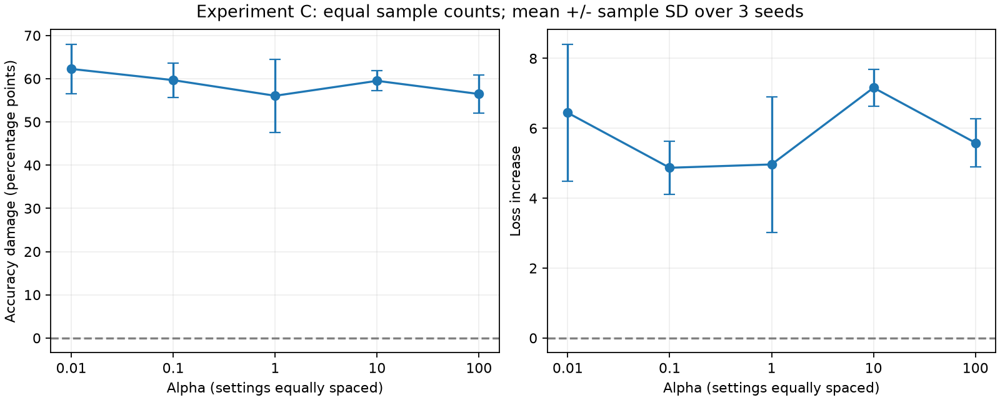

# 實驗 C：固定每端資料量

每端 12,000 張，FedAvg 權重 20%；Scale = 10；seeds 42、43、44。

`summary.csv` 為平均與樣本標準差；`per_seed.csv` 為各 seed 結果。Accuracy 損害是 Clean 減 Poisoned（百分點）；Loss 損害是 Poisoned 減 Clean。

此分配方法先抽取每類數字的 client 偏好，再依容量分配全部圖片。不是原版無容量限制的 Dirichlet 方法；應配合 preflight 的數字分布圖判斷 Alpha 實際帶來的差異。A/C 的差異同時包含分配演算法變更，不能把所有差異直接歸因於權重。
